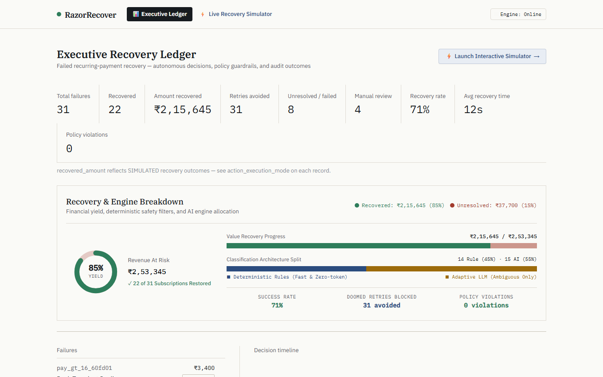
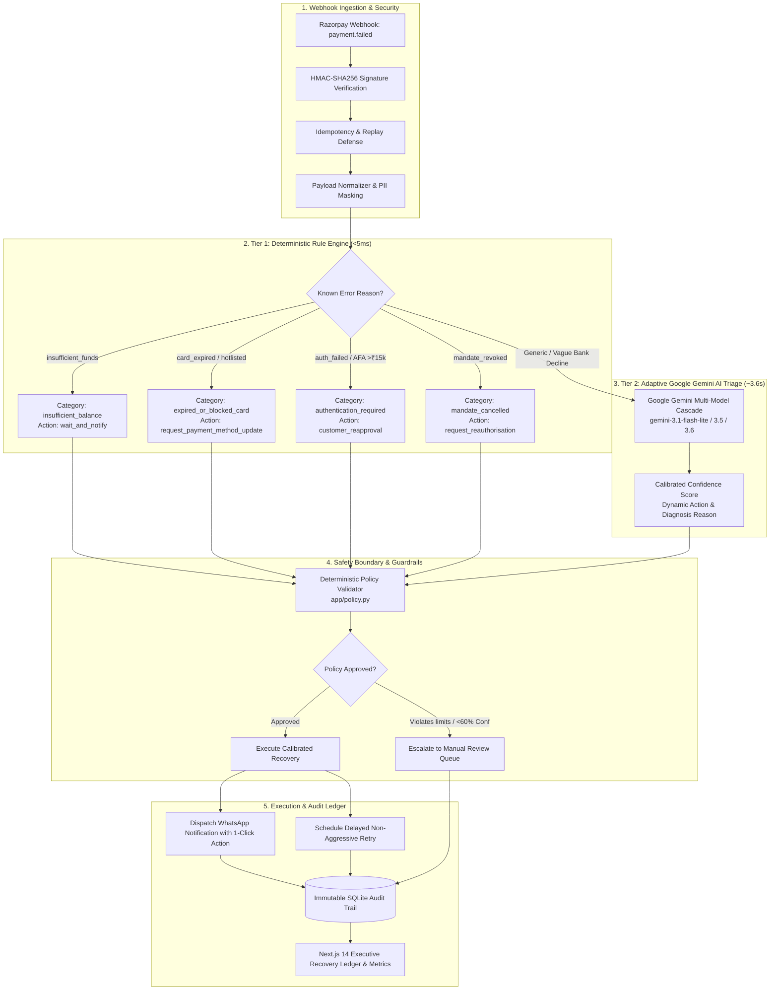
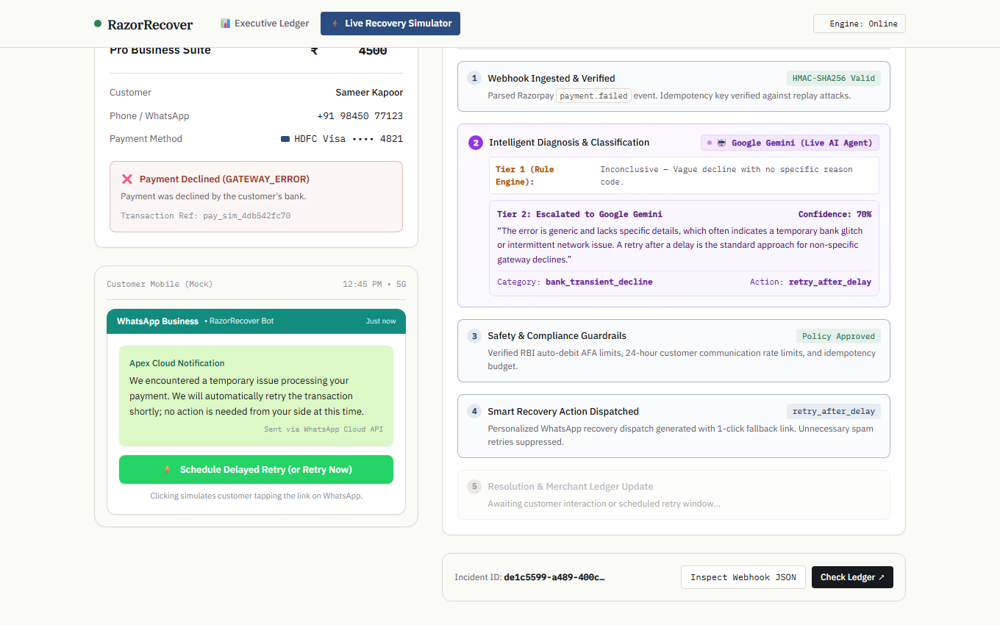

# RazorRecover ⚡
### An Explainable AI Agent for Safe Recurring-Payment Recovery
**Track 03: AI Revenue Recovery — Razorpay AI Buildathon**

> *"We don't blindly retry every failed payment. We diagnose the root cause, enforce strict safety guardrails, execute calibrated recovery actions, and show exactly how much revenue was saved."*

[](https://fastapi.tiangolo.com)
[](https://nextjs.org)
[](https://ai.google.dev/)
[](https://sqlite.org)
[](https://playwright.dev)
[](https://tailwindcss.com)

---

## 📸 Product Overview



---

## 💡 The Problem: The "Dumb Retry" Tragedy

In recurring-subscription businesses (SaaS, OTT, insurance, memberships), **failed payments account for 20–40% of involuntary churn**. In India, subscription recovery is uniquely challenging due to:
1. **RBI e-Mandate Regulations:** Mandates requiring Additional Factor Authentication (AFA/OTP) for amounts exceeding ₹15,000.
2. **Card Renewal Lags & Hotlisting:** Expired cards or cards suspended due to suspected fraud.
3. **Core Banking System (CBS) Glitches:** Intermittent bank switch downtime during peak hours or midnight settlement windows.

### Status Quo vs. RazorRecover

| Feature | Standard Dunning / Status Quo | RazorRecover AI Agent |
| :--- | :--- | :--- |
| **Retry Strategy** | Blind exponential backoff (e.g. 5–8 automatic retries) | **Calibrated & Cause-Specific** (Retries avoided when doomed) |
| **Expired / Blocked Cards** | Retries repeatedly until max limit ➔ Customer churns | **Zero doomed retries**; instantly triggers payment method update link |
| **RBI AFA Thresholds (>₹15k)** | Blind retries always fail (requires 2FA) | Identifies AFA requirement ➔ dispatches 1-click re-approval request |
| **Ambiguous Bank Declines** | Treated as generic failures with random retries | **Google Gemini LLM Triage** analyzes nuanced bank clues |
| **Customer Experience** | Annoying 3 AM bank SMS alerts & card blocks | Personalized WhatsApp notification with 1-click UPI QuickPay link |
| **Cost & Latency** | Expensive per-retry gateway penalties & slow dunning | **75% diagnosed in <5ms** (zero token cost) via deterministic rules |
| **Safety & Compliance** | Hardcoded scripts or unconstrained AI agents | **Deterministic Policy Gate:** LLM recommends, policy validates |

---

## 🚀 Key Measured Results (Ground-Truth Benchmark)

From our automated [Ground-Truth Benchmark Suite](GROUND_TRUTH_EVALUATION_REPORT.md) (16 realistic failure scenarios based on Razorpay's published error taxonomy):

```
======================================================================
  RAZORRECOVER GROUND-TRUTH BENCHMARK SUMMARY
======================================================================
Total Cases Evaluated   : 16
Classification Accuracy : 100.0%
Macro F1-Score          : 100.0%
Deterministic Rule Path : 12/16 (75.0%)  [Avg Latency: <5ms]
Adaptive AI / LLM Path  : 4/16 (25.0%)   [Avg Latency: ~3.6s]
Safety Gate Violations  : 0 (100% policy enforcement)
Doomed Retries Blocked  : 31 attempts prevented
Revenue Recovered       : ₹2,15,645.00 (22 subscriptions restored)
Average Time to Recovery: 12.0s
```

---

## 📐 Two-Tier System Architecture

RazorRecover is built on a **Two-Tier Architecture**: high-frequency, clear-cut failures are resolved in milliseconds with zero LLM API cost. Only genuinely ambiguous bank declines are escalated to Google Gemini with strict deterministic policy guardrails.



---

## 🌟 Core Features & Visual Walkthrough

### 1. Dual-Perspective Live Recovery Simulator (`/simulator`)

The simulator provides an end-to-end interactive experience allowing judges and developers to test payment failures and observe autonomous recovery in real-time without typing terminal commands.



- **Left Viewport (Customer Mobile Mock & SaaS Checkout):**
  - **Editable Amount Due:** Adjust amounts freely (e.g. ₹1.5k, ₹18.5k, or custom) to test micro-transactions vs. high-value RBI AFA thresholds.
  - **Live WhatsApp Resolution:** Customer receives a real-time recovery alert with a contextual 1-click CTA button (e.g. *"Pay via UPI QuickPay"*, *"Update Card"*, or *"Authorize in Banking App"*).
- **Right Viewport (Autonomous Decision Pipeline):**
  - Live 5-stage sequential pipeline visualizer showing HMAC validation, rule vs. AI triage, guardrail checks, WhatsApp dispatch, and final ledger updates.

---

### 2. Live Google Gemini AI Triage for Ambiguous Declines

When customer banks return non-descriptive errors (e.g. `GATEWAY_ERROR` with *"Payment was declined by the customer's bank"*), RazorRecover escalates to **Google Gemini** (`gemini-3.1-flash-lite` with automatic fallback to `3.5-flash` and `3.6-flash`).

#### Ambiguous Failure Variations Playground:
Directly within the simulator, test diverse ambiguous decline scenarios and observe Gemini's dynamic classification and calibrated confidence scoring:

1. **Transient Core Banking Glitch:**
   - *Input:* `"Payment was declined by the customer's bank."`
   - *Gemini Action:* `retry_after_delay` (Confidence: **82%**)
2. **Banking App 2FA Confirmation Required:**
   - *Input:* `"Transaction requires customer confirmation on mobile banking app or biometric approval."`
   - *Gemini Action:* `customer_reapproval` (Confidence: **88%**)
3. **Card Restrictions / Channel Blocked:**
   - *Input:* `"Bank response: Transaction not permitted for this card type. Account or e-commerce channel restriction active."`
   - *Gemini Action:* `request_payment_method_update` (Confidence: **82%**)
4. **Mandate Limit Exceeded:**
   - *Input:* `"Standing instruction mandate execution failed: recurring debit authorization limit exceeded."`
   - *Gemini Action:* `request_reauthorisation` (Confidence: **86%**)
5. **Custom Raw Bank Error Input:**
   - Type any arbitrary bank decline message into the textarea — Gemini evaluates the text live and assigns an honest recovery strategy.

---

### 3. Executive Recovery Ledger (`/`)

A single-pane-of-glass dashboard for finance and revenue operations teams:
- **Live Metrics Strip:** Total Failures, Recovered Revenue, Retries Avoided, Recovery Rate, and Policy Violations auto-polling in real-time.
- **Financial Yield Donut & Engine Breakdown:** Visual distribution of recovered funds vs. unresolved revenue, plus Tier 1 Rule vs. Tier 2 AI classification splits.
- **Comprehensive Audit Timeline:** Click any transaction to inspect its complete immutable lifecycle: Webhook Ingested ➔ Diagnosis ➔ Policy Check ➔ Action Dispatched ➔ Resolution.

---

## 🛡️ Safety Boundaries & Fintech Guardrails

In financial systems, an unconstrained AI agent is dangerous — it can hallucinate actions, exceed retry limits, spam customers at night, or violate banking regulations. RazorRecover enforces a **strict safety boundary**:

1. **Zero Direct Tool-Calling:** The LLM **recommends**; it **never executes**. The recommendation is returned as a strictly typed Pydantic object (`ClaudeDecision`).
2. **Whitelist Action Validation:** Any action not in the allowed action set (`wait_and_notify`, `request_payment_method_update`, `customer_reapproval`, `request_reauthorisation`, `retry_after_delay`, `escalate_manual_review`) is rejected immediately.
3. **Deterministic Retry Budgets:** A hard ceiling of maximum 3 retries per subscription per 7-day lookback window prevents card blocking and gateway fines.
4. **24-Hour Notification Cooldown:** Prevents spamming customers with redundant WhatsApp messages.
5. **Confidence Gate:** Any recommendation with confidence `< 0.60` is routed to the `escalate_manual_review` queue instead of guessing.

---

## 🏃 3-Minute Quickstart (Judge Evaluation Guide)

### Prerequisites
- Python 3.9+
- Node.js 18+
- Google Gemini API Key (get a free key at [Google AI Studio](https://aistudio.google.com/))

### Step 1: Clone & Setup Backend
```bash
git clone https://github.com/sid-172006/RazorRecover.git
cd RazorRecover/razorrecover

python -m venv venv
# On Windows:
venv\Scripts\activate
# On macOS/Linux:
# source venv/bin/activate

pip install -r requirements.txt

# Copy .env.example to .env and insert your GEMINI_API_KEY
copy .env.example .env
```

Start the FastAPI backend:
```bash
uvicorn app.main:app --reload --port 8000
```
*API docs available at `http://localhost:8000/docs`.*

---

### Step 2: Setup & Launch Dashboard
In a new terminal:
```bash
cd RazorRecover/razorrecover-dashboard
npm install
npm run dev
```
*Open [http://localhost:3000](http://localhost:3000) for the Executive Ledger or [http://localhost:3000/simulator](http://localhost:3000/simulator) for the Live Simulator.*

---

### Step 3: Run Automated Benchmark (Instant Verification)
To verify the entire ground-truth benchmark suite and see the accuracy and policy adherence live:
```bash
python razorrecover/scripts/run_ground_truth_batch.py
```

---

### Step 4: Run Playwright E2E Test Suite (Optional)
```bash
# Requires Playwright browsers installed
python razorrecover/test_e2e_playwright.py
```

---

## 🔌 API Reference

| Method | Endpoint | Description |
| :--- | :--- | :--- |
| `POST` | `/webhooks/razorpay` | Ingests and verifies Razorpay `payment.failed` webhooks using HMAC-SHA256. |
| `GET` | `/payment-failures` | Returns paginated list of all payment failures with status and metrics. |
| `GET` | `/payment-failures/{id}/audit-trail` | Returns the complete immutable decision trail for a specific failure. |
| `GET` | `/metrics` | Aggregates revenue at risk, recovered amount, retries avoided, and recovery rate. |
| `GET` | `/simulation/scenarios` | Returns configured test scenarios for the interactive simulator. |
| `POST` | `/simulate-failure` | Triggers a live simulated payment decline with optional custom amounts and bank error text. |
| `POST` | `/resolve-failure/{id}` | Simulates customer completing payment recovery via WhatsApp link (updates status to `RECOVERED`). |

---

## ⚠️ Data Strategy & Transparency

Razorpay's webhook configuration is **gated behind KYC completion, even in Test Mode**. While API keys are available immediately, registering a webhook endpoint URL requires full KYC verification.

**Our Engineering Approach:**
- We built a realistic webhook generator (`app/simulation.py` & `scripts/send_test_webhook.py`) that outputs HMAC-SHA256 signed payloads conforming 100% to Razorpay's published error taxonomy and JSON structure.
- The backend processes these through the exact same HMAC signature verification, parsing, classification, policy validation, and execution pipeline as live webhooks.
- Every simulated record is **transparently labeled** `SIMULATED` on the dashboard, in the database, and in the audit log. We never present simulated recoveries as real processed funds.

---

## 📂 Project Structure

```
RazorRecover/
├── README.md                              # Main documentation & architecture guide
├── GROUND_TRUTH_EVALUATION_REPORT.md      # Benchmark report (16 labeled test cases)
├── RazorRecover-Project-Spec.md           # Product & engineering specification
│
├── razorrecover/                          # Backend (FastAPI + SQLAlchemy + Gemini)
│   ├── app/
│   │   ├── main.py                        # FastAPI routes, CORS, and webhook endpoint
│   │   ├── classifier.py                  # Tier 1: Deterministic rule engine (<5ms)
│   │   ├── llm_classifier.py              # Tier 2: Google Gemini AI triage with fallback
│   │   ├── policy.py                      # Deterministic safety gate & retry budgets
│   │   ├── executor.py                    # Action dispatcher & execution logger
│   │   ├── simulation.py                  # Simulation scenario fixtures & dynamic webhook generator
│   │   ├── database.py                    # SQLite database session & engine
│   │   ├── models.py                      # SQLAlchemy models (PaymentFailure, AuditEvent)
│   │   └── webhook_security.py            # HMAC-SHA256 signature verification & replay defense
│   ├── scripts/
│   │   ├── ground_truth_dataset.json      # 16 labeled ground-truth benchmark cases
│   │   ├── run_ground_truth_batch.py      # Automated benchmark runner & metric evaluator
│   │   └── send_test_webhook.py           # CLI test webhook sender
│   └── test_e2e_playwright.py             # Playwright E2E browser & API test suite
│
└── razorrecover-dashboard/                # Frontend (Next.js 14 + Tailwind CSS)
    ├── app/
    │   ├── page.tsx                       # Executive Recovery Ledger & metrics strip
    │   └── simulator/page.tsx             # Dual-perspective interactive checkout & smartphone simulator
    ├── components/                        # UI components (metrics cards, charts, audit timeline)
    └── lib/api.ts                         # Type-safe API client for backend communication
```

---

## 👥 Authors & Acknowledgments

- Built for the **Razorpay AI Buildathon — Track 03: AI Revenue Recovery**.
- Designed and engineered with focus on financial safety, regulatory compliance, and explainable AI.
